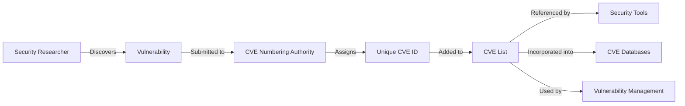
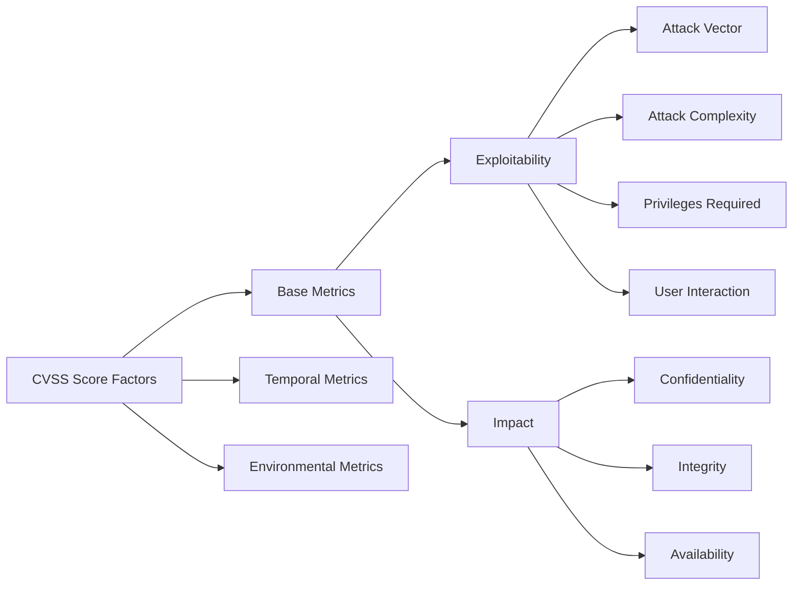
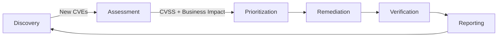

## What is a CVE?

Common Vulnerabilities and Exposures (CVE) is the standardized system used to identify, catalog, and reference known cybersecurity vulnerabilities. Every CVE entry gets a unique identifier (for example, [CVE-2021-44228](https://nvd.nist.gov/vuln/detail/cve-2021-44228) for [Log4Shell](https://en.wikipedia.org/wiki/Log4Shell)) so security professionals, software developers, and users can track and address specific security flaws consistently across platforms and tools.

## The role of CVEs in Cybersecurity

CVEs sit at the foundation of modern vulnerability management. Specifically, they provide:

- **A universal reference system**, a shared language for discussing specific security flaws
- **Standardized documentation** across different platforms
- **Data to prioritize remediation**, so organizations can focus on the most critical fixes
- **A coordination mechanism** for vulnerability disclosure and patching
- **A historical record** of known vulnerabilities for future reference and analysis

When a new vulnerability surfaces, the CVE identifier lets any security team locate patches, workarounds, and related information, independent of which security tools or platforms they happen to use.

## Who Assigns CVEs?

The CVE program runs through a distributed network of CVE Numbering Authorities (CNAs):

- **MITRE Corporation**, the primary CNA that coordinates the overall CVE program, sponsored by the U.S. Department of Homeland Security's Cybersecurity and Infrastructure Security Agency (CISA)
- **Vendor CNAs**, major technology companies like Microsoft, Google, Apple, and Red Hat that assign CVEs directly for their own products
- **Third-party CNAs**, security research organizations, academic institutions, and regional coordination centers
- **Global coverage**, hundreds of CNAs spread across different organizations and geographies

The distributed approach makes vulnerability publication faster: vendors can assign CVEs without waiting on a central bottleneck. When a security researcher discovers a vulnerability, they typically contact either the affected vendor (if the vendor is a CNA) or MITRE directly to initiate a CVE assignment.

  <em>Fig 1: The CVE assignment and documentation process</em>

The diagram traces how vulnerabilities move from discovery to standardized identification through the CVE system, enabling consistent tracking and remediation across the ecosystem.

## Important Considerations About CVEs

A CVE assignment doesn't always mean a vulnerability is fully understood or fixed. CVEs can be issued before patches exist, and the technical detail in a given entry varies widely. Some are comprehensive, others (particularly during embargo periods) stay sparse.

The mere presence of a CVE doesn't confirm the vulnerability has been verified in every reported context. Timing between discovery, assignment, and public disclosure shifts based on severity and responsible disclosure norms. Security professionals should read CVE details and associated references in full rather than assuming a CVE ID alone tells them what they need.

## CVE Identifiers and CVSS Scoring System

### Anatomy of a CVE identifier

A CVE ID follows a standard format: CVE-YEAR-NUMBER. Examples:

- **CVE-2021-44228**, the infamous Log4Shell vulnerability
- **CVE-2014-0160**, the Heartbleed bug in OpenSSL
- **CVE-2017-5715**, the Spectre vulnerability affecting CPUs

The year portion indicates when the CVE was assigned (not necessarily when the vulnerability was discovered). The number is a unique sequence identifier.

### CVE severity assessment: understanding CVSS

The Common Vulnerability Scoring System (CVSS) gives CVEs standardized severity scores. Scores range from 0 to 10, mapped to these severity levels:

- **Critical (9.0–10.0)**: vulnerabilities that allow remote code execution without authentication
- **High (7.0–8.9)**: significant vulnerabilities that warrant immediate attention
- **Medium (4.0–6.9)**: important vulnerabilities with mitigating factors
- **Low (0.1–3.9)**: vulnerabilities with minimal impact or difficult exploitation

  <em>Fig 2: Components of the CVSS scoring system</em>

This breakdown shows the pieces that go into a CVSS score, which is what security teams use to prioritize remediation based on risk.

## Defining Vulnerabilities in the Context of CVEs

In cybersecurity, a vulnerability is a weakness or flaw in a system or application that could be exploited to compromise security. These include:

- **Software bugs**, coding errors with security implications
- **Configuration errors**, systems or applications set up insecurely
- **Design flaws**, architectural issues that create security problems
- **Implementation weaknesses**, proper designs implemented incorrectly

CVEs specifically document vulnerabilities that:

- Have security implications
- Affect specific software, firmware, or hardware
- Can be fixed or mitigated
- Impact users beyond the discoverer

## What Is an Exploit?

An exploit is a program, script, or technique designed to take advantage of a known security vulnerability. Vulnerabilities are the weakness. Exploits are the tools or methods that attackers use to turn a weakness into unauthorized access (or worse).

### Types of exploits

Exploits generally fall into a few categories:

- **Remote exploits**, which let attackers target a vulnerable system over a network without prior access
- **Local exploits**, which require the attacker to already have some access and are often used for privilege escalation or lateral movement
- **Zero-day exploits**, which target vulnerabilities with no public CVE identifier or patch yet
- **Client-side exploits**, which target vulnerabilities in applications users run (browsers, document readers)
- **Server-side exploits**, which target vulnerabilities in server applications and services

### How exploits relate to CVEs

Once a vulnerability is disclosed and a CVE ID is assigned, researchers may develop or release exploits to demonstrate risk. These typically show up in:

- **[Exploit-DB](https://www.exploit-db.com/)**, a repository of public exploits and corresponding vulnerable software
- **[Metasploit Framework](https://www.metasploit.com/)**, an open-source penetration testing platform with exploit modules
- **Security advisories**, vendor and CERT notifications that reference exploit techniques
- **Bug trackers**, public issue tracking systems where vulnerabilities are documented
- **Academic papers**, detailed analysis of vulnerabilities and exploitation techniques

:::caution
**Important**: While exploits serve as essential tools in security testing and vulnerability verification, using them without proper authorization against systems you don't own is illegal in most jurisdictions and violates professional ethics in cybersecurity.
:::

### Exploit development and availability

Not every CVE has a public exploit. Factors that affect availability:

- **Vulnerability complexity**, some vulnerabilities are theoretically exploitable but hard to weaponize
- **Researcher decisions**, some researchers decline to publish exploit code for critical vulnerabilities
- **Vendor coordination**, responsible disclosure often delays public exploit release
- **Target value**, high-value vulnerabilities may have privately-developed exploits that never get shared

Understanding the relationship between CVEs and exploits is how security teams assess the actual real-world risk of a given vulnerability.

## Key CVE Resources

### Official CVE list and databases

The official CVE List is maintained by MITRE. Several enhanced databases add detail and search capabilities on top:

- **[National Vulnerability Database (NVD)](https://nvd.nist.gov/)**, the U.S. government repository with enhanced CVE data
- **[CVE Details](https://www.cvedetails.com/)**, a user-friendly interface for exploring and analyzing CVEs
- **[MITRE CVE](https://cve.mitre.org/)**, the official source for CVE records
- **[Exploit Database](https://www.exploit-db.com/)**, links CVEs to specific exploit techniques
- **[VulnDB](https://vulndb.cyberriskanalytics.com/)**, commercial database with additional vulnerabilities not in CVE

These resources let security professionals search vulnerabilities by software vendor, product name, version, and other criteria.

## CVE vs. CWE: Understanding the Difference

Common Vulnerabilities and Exposures (CVE) and Common Weakness Enumeration (CWE) are complementary but distinct classification systems:

- **CVE** identifies specific vulnerabilities in particular software or systems (e.g., CVE-2021-44228 for the Log4Shell vulnerability in Log4j)
- **CWE** categorizes types of weaknesses (e.g., CWE-79 for Cross-Site Scripting)

In practice:

- A CWE describes a class of vulnerability
- A CVE identifies a specific instance of a vulnerability in a particular product
- Many CVEs can map to the same CWE

Security teams use both together to see the specific vulnerabilities (CVEs) and the underlying weakness patterns (CWEs) they need to address.

## The Vulnerability Management Process with CVEs

Organizations use CVEs inside a structured vulnerability management process:

1. **Identification.** Monitoring CVE announcements and vulnerability disclosures relevant to their environment.
2. **Assessment.** Evaluating which vulnerabilities pose a risk in that specific environment.
3. **Prioritization.** Using CVSS scores and business context to decide which vulnerabilities to address first.
4. **Remediation.** Applying patches, implementing workarounds, or consciously accepting risk.
5. **Verification.** Confirming that remediation efforts actually resolved the vulnerability.
6. **Reporting.** Documenting vulnerability status and remediation efforts.

  <em>Fig 3: The vulnerability management lifecycle</em>

The cycle is continuous, because new vulnerabilities keep being discovered and added to the CVE list.

## Addressing Vulnerabilities: How Companies Fix Security Flaws

Organizations use several methods to remediate vulnerabilities identified by CVEs:

- **Patching**, applying vendor-provided updates
- **Configuration changes**, adjusting settings to mitigate the vulnerability
- **Compensating controls**, additional security measures when a direct fix isn't available
- **Application firewalls**, blocking exploitation attempts at the network level
- **Runtime protection**, security tools that prevent exploitation during execution
- **Integrated security platforms**, solutions like Distr that detect vulnerabilities in artifacts stored in the registry and also recommend and facilitate applying patches
- **Minimal base images**, using CVE-free or minimal-footprint container images like Chainguard Images, built with security in mind to dramatically reduce the attack surface

Which approach applies depends on the nature of the vulnerability, the affected system, and operational constraints.

## How to Stay Informed About New CVEs

Rather than only catching and patching vulnerabilities after they're discovered, proactive organizations adopt preventative approaches:

- **Minimal attack surface**, using CVE-free container images like Chainguard Images that are specifically built to minimize potential for vulnerabilities
- **DevSecOps practices**, integrating security throughout the development lifecycle so issues get caught before production
- **Dependency minimization**, reducing the number of dependencies so fewer vulnerabilities get inherited
- **Principle of least privilege**, limiting access rights to minimize the impact of exploits
- **Infrastructure as code**, using validated, versioned infrastructure definitions that can be updated quickly when vulnerabilities surface

## CVE Integration in Security Management Tools

Security teams mostly interact with CVEs through tooling that integrates CVE data:

- **Vulnerability management systems**, enterprise platforms like Rapid7 InsightVM, Tenable.io, and Microsoft Defender Vulnerability Management that track, prioritize, and manage vulnerabilities with CVE data
- **Configuration management databases**, systems that catalog software and hardware components and their associated CVEs
- **Patch management solutions**, tools that correlate patches with CVEs for complete remediation
- **Threat intelligence platforms**, which contextualize CVEs against known threat actor activity
- **Software composition analysis (SCA)**, tools like OWASP Dependency-Check, Snyk, and GitHub Dependabot that identify dependencies with known CVEs
- **Artifact registries with security features**, platforms like Distr that track CVEs affecting stored artifacts, recommend patches, and facilitate remediation
- **Secure container registries**, solutions that offer CVE-free base images like Chainguard Images or make it easy to migrate to them

These tools are how organizations actually monitor, track, and remediate the vulnerabilities documented in the CVE system.

## The Limitations of CVEs

CVEs bring real value, but they have real limitations too.

- **Coverage gaps.** Plenty of vulnerabilities never get a CVE identifier, especially:
  - Issues in less popular or open source software without dedicated security teams
  - Vulnerabilities discovered and fixed internally before public disclosure
  - Configuration weaknesses (which the NIST National Vulnerability Database may track but may not assign CVEs for)

- **Publication delays.** Responsible disclosure often includes embargo periods where a CVE is reserved but not published, creating a gap between assignment and public availability.

- **Inconsistent detail.** Technical information varies widely between CVEs, depending on who submitted it and disclosure status.

- **Limited scope.** CVEs focus on known software and hardware flaws, not misconfigurations, weak credentials, social engineering, or other security issues.

- **Prioritization challenges.** The sheer volume (over 20,000 new entries annually) makes it hard for organizations to decide what to address first.

Knowing where the CVE system stops helps security teams build vulnerability management strategies that go beyond just tracking CVEs.

## How to Report a CVE

If you discover a vulnerability, the reporting path for a CVE ID usually looks like this:

1. **Determine the appropriate CNA.** Contact the vendor if they're a CNA, or reach out to MITRE directly.
2. **Prepare vulnerability information.** Document technical details, affected versions, and potential impact.
3. **Submit the report.** Follow the CNA's submission process (usually a web form or email).
4. **Coordinate disclosure.** Work with the vendor on responsible disclosure timelines.
5. **Verify publication.** Confirm the CVE shows up in the official CVE List once the disclosure period ends.

For more detail, see [MITRE's CVE report process](https://cve.mitre.org/cve/report_id.html) or the vendor-specific security vulnerability reporting instructions.

## Key Terms

- **CVE**: Common Vulnerabilities and Exposures, the standard for identifying and documenting specific security vulnerabilities
- **CVSS**: Common Vulnerability Scoring System, the method for assigning severity ratings to documented vulnerabilities
- **Vulnerability**: a weakness in a system that could be exploited to compromise security
- **CWE**: Common Weakness Enumeration, a classification system for vulnerability types
- **Zero-day**: a vulnerability exploited before it's publicly known or documented with a CVE
- **Exploit**: either a technique or actual code that takes advantage of a vulnerability
- **Patch**: a software update that fixes a vulnerability
- **CNA**: CVE Numbering Authority, organizations authorized to assign CVE IDs
- **NVD**: National Vulnerability Database, the U.S. government repository of vulnerability documentation
